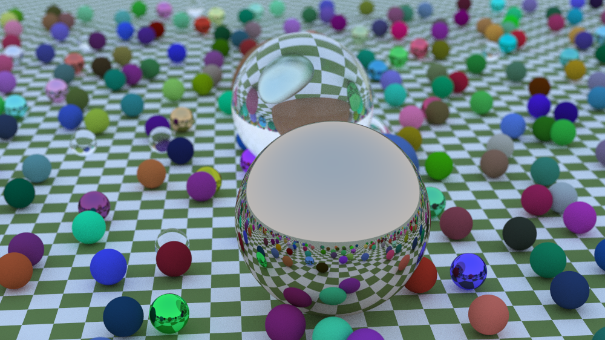

# Monte Carlo Ray Tracer

A physically-based Monte Carlo ray tracer written in C++ featuring BVH acceleration, multiple material types, and configurable runtime settings. Built as part of a computer graphics course to explore advanced rendering techniques.


*Sample scene showcasing spheres with dielectric, specular, and diffuse materials*

## Features

### Core Rendering
- **Monte Carlo Path Tracing**: Physically-based light transport simulation with multiple importance sampling
- **BVH Acceleration Structure**: Efficient ray-geometry intersection testing using bounding volume hierarchies
- **Multi-threaded Rendering**: Parallel ray generation for improved performance

### Geometry Support
- **Primitive Intersections**: Optimized sphere and triangle intersection routines
- **Triangle Meshes**: Support for loading and rendering complex 3D models
- **BVH Construction**: Automatic spatial partitioning for fast intersection queries

### Material System
- **Lambertian Diffuse**: Energy-conserving diffuse reflection with cosine-weighted sampling
- **Specular Reflection**: Perfect mirror-like reflections
- **Dielectric Materials**: Physically-accurate refraction with Fresnel equations (glass, water, etc.)
- **Texture Mapping**: Image-based textures loaded via STB library

### Camera System
- **JSON Configuration**: Runtime-configurable camera parameters including:
  - Position and orientation
  - Field of view
  - Aperture and focus distance (depth of field)
  - Image resolution
  - Sample count per pixel

### In Development
- **Hybrid GPU Rendering**: GPU-accelerated BVH traversal and intersection testing for significant performance improvements

## Technical Highlights

- Clean, modular C++ architecture separating geometry, materials, and rendering systems
- Custom BVH implementation with SAH (Surface Area Heuristic) optimization
- JSON-based scene description for easy experimentation
- Importance sampling techniques for variance reduction
- Extensible material system for adding new BRDF models

## Dependencies

- **STB Libraries**: Image loading and writing (`stb_image.h`, `stb_image_write.h`)
- **JSON Library**: [nlohmann/json](https://github.com/nlohmann/json) for configuration parsing
- **C++17 or later**: Modern C++ features for cleaner code
- Standard library threading support

## Building

```bash
# Clone the repository
git clone https://github.com/yourusername/raytracer.git
cd raytracer

# Create build directory
mkdir build && cd build

# Configure and build
cmake ..
make

# Create scene or select preset by modifying main.cpp

# Run the ray tracer
./raytracer > out.ppm
```

## Usage

Create a JSON configuration file to define camera presets:

```json
{
  "default": {
    "imageWidth": 1000,
    "samplesPerPixel": 44,
    "maxDepth": 10,
    "vfov": 45.0,
    "lookfrom": [0, 2, 5],
    "lookat": [0, 0, 0],
    "vup": [0, 1, 0],
    "aspectRatio": 1.777,
    "defocusAngle": 0.05,
    "focusDist": 5.0
  },
  "wide": {
    "imageWidth": 800,
    "samplesPerPixel": 100,
    "maxDepth": 20,
    "vfov": 100.0,
    "lookfrom": [2, 2, 5],
    "lookat": [0, 0, 0],
    "vup": [0, 1, 0]
  },
  "closeup": {
    "imageWidth": 1200,
    "samplesPerPixel": 200,
    "maxDepth": 15,
    "vfov": 30.0,
    "lookfrom": [0, 1, 3],
    "lookat": [0, 0, 0],
    "vup": [0, 1, 0],
    "defocusAngle": 0.1,
    "focusDist": 3.0
  }
}
```

Run the ray tracer with your scene file:

```bash
./raytracer wide > output.ppm
```

Images are output to stdout in ppm format.

## Example Renders

| Cornell Box | Glass Spheres | Textured Mesh |
|-------------|---------------|---------------|
|  |  |  |

## Future Improvements

- [ ] Complete hybrid GPU rendering implementation
- [ ] Additional material models (anisotropic, subsurface scattering, emissive)
- [ ] Alternative sampling methods
- [ ] Improved method for creating scenes
- [ ] Progressive rendering with live preview

## Learning Outcomes

This project provided hands-on experience with:
- Advanced C++ programming and memory management
- Ray-geometry intersection algorithms
- Spatial acceleration data structures (BVH)
- Monte Carlo integration techniques
- Physically-based rendering theory
- GPU computing with CUDA/OpenCL (in progress)

## References

- *Ray Tracing in One Weekend* series by Peter Shirley
- *Physically Based Rendering: From Theory to Implementation* by Pharr, Jakob, and Humphreys
